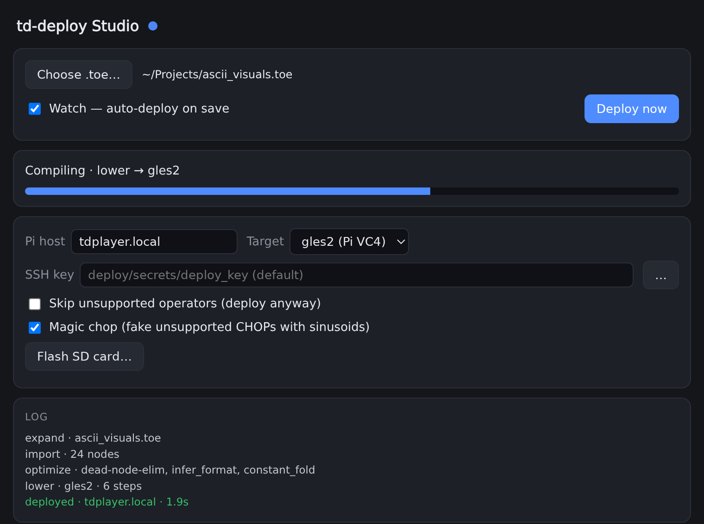
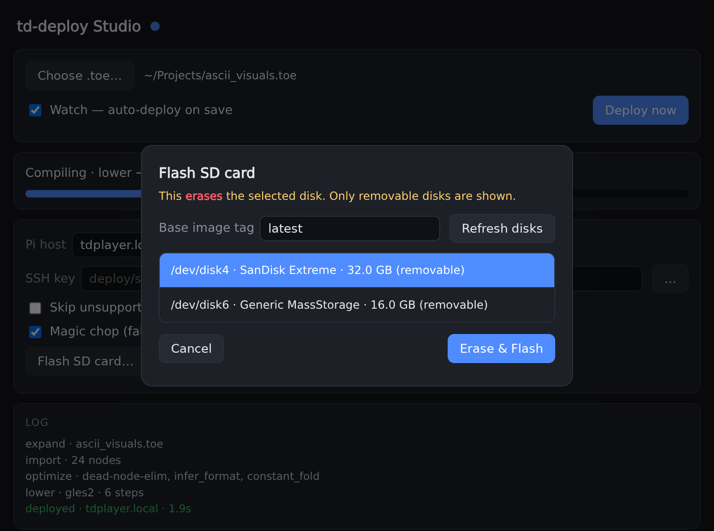
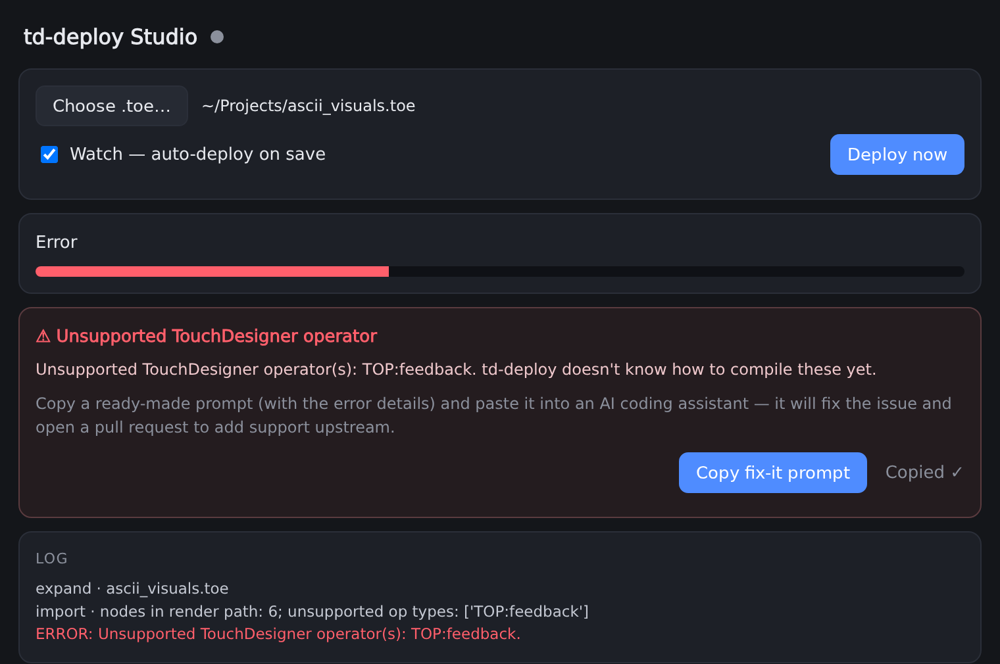

# td-deploy

**Run your TouchDesigner visuals on a Raspberry Pi — no TouchDesigner on the Pi, no
command line.** Point the **td-deploy Studio** app at your `.toe` project; it compiles
the graph and sends it to the Pi. Flip on **Watch** and every save in TouchDesigner
redeploys live.

  

## What you get

- 🎛️ **A desktop app** (macOS + Windows). Pick a project, click **Deploy** — done.
- 🔁 **Live reload.** With **Watch** on, saving in TouchDesigner auto-deploys to the Pi.
- 💾 **One-click SD flashing.** The app writes a ready-to-boot Pi card for you.
- 🍓 **A tiny, fast Pi appliance.** The card boots straight into your visuals on
  hardware graphics — no desktop, no TouchDesigner, no setup.

## 1. Install the app

Download the latest build from the [**Releases page**](https://github.com/fughilli/td-deploy/releases/latest):

- **macOS** — open `td-deploy Studio-*.dmg` and drag the app to Applications. It's
  signed and notarized, so it opens normally.
- **Windows** — run `td-deploy Studio Setup *.exe`.

## 2. Prepare an SD card

Insert an SD card (8 GB or larger), then in the app click **Flash SD card…**, pick your
card from the list of removable disks, and hit **Erase & Flash**.

  

> ⚠️ Flashing **permanently erases** the selected disk. The app lists only removable
> disks to help you avoid picking the wrong one, but **always double-check the device
> name and size before you flash** — you are responsible for choosing the right disk.

Put the card in the Pi, connect HDMI + power, and it boots into the player.

## 3. Deploy your project

1. Click **Choose .toe…** and pick your TouchDesigner project.
2. Set **Pi host** — the default `tdplayer.local` works out of the box.
3. Click **Deploy now**.

Turn on **Watch — auto-deploy on save** and the app redeploys automatically every time
you save in TouchDesigner, so you can dial in your visuals against the real hardware.

## Which TouchDesigner projects work

td-deploy understands a **growing subset** of TouchDesigner's operators — not the whole
set (TouchDesigner has hundreds). Today that covers common image (TOP) operators — Movie
File In, GLSL, Transform, Crop, Level — plus OSC In and MIDI In for live control. The
full, always-current list lives in the developer docs:
[**Supported operators**](DEVELOPERS.md#supported-operators).

If your project uses an operator td-deploy doesn't recognize yet, the deploy stops and
names the operator in the **Log** — it never silently ships wrong output — and the app
offers a one-click way to get it fixed.

### Get missing operators added — one click

Whenever a deploy fails — or finishes but the engine had to substitute something it
doesn't support yet (an operator or a CHOP) — Studio calls it out in the **Log** and
shows a **Copy fix-it prompt** button:

  

Click it to copy a ready-made prompt that already includes the error and its details.
Paste that into an AI coding assistant (Claude Code, Cursor, ChatGPT, …) and it will:

- diagnose the problem in the td-deploy source,
- add support for the missing operator (or fix the bug), and
- open a pull request against the project so the fix ships for everyone.

You don't have to write any code — you click **Copy**, paste, and approve the result. If
you haven't set up a GitHub account or credentials, the prompt tells the assistant to
walk you through forking the project and signing in first.

### Or deploy anyway

If you'd rather watch the rest of your project run while an operator is still unsupported,
tick **Skip unsupported operators (deploy anyway)** in the settings. Instead of stopping,
td-deploy swaps each unsupported operator for a placeholder — an effect in the chain
passes its input through untouched; a source with nothing to pass through becomes a blank
test image — then deploys and shows the fix-it prompt as a non-blocking **warning** so you
can still get it added.

### Magic chop — keep it moving

Projects often drive parameters from CHOPs td-deploy can't run yet — an LFO, a noise or
pattern generator, an audio-reactive channel. Left alone, those inputs sit at zero and the
piece looks frozen. Tick **Magic chop** and td-deploy feeds each unsupported CHOP channel
a gentle sine wave at a random period, so there's motion to preview while real support is
added. It's still listed in the log and the fix-it prompt, so nothing is hidden.

## Troubleshooting

- **The app can't reach the Pi.** Give the card ~30 s to boot, make sure your computer
  and the Pi are on the same network, and try again. If `tdplayer.local` doesn't
  resolve, use the Pi's IP address in the **Pi host** field.
- **Which Target do I pick?** Leave it on **gles2 (Pi VC4)** for a Pi 3. Use **gles**
  for a Pi 4/5.
- **The screen is black.** Confirm your project actually renders in TouchDesigner, then
  re-deploy. The **Log** panel at the bottom shows each step and any errors.

## Supported hardware

Raspberry Pi 3 and Pi 4/5. HDMI output. The player image is a minimal, headless build
that uses the Pi's hardware GPU.

## License & disclaimer

td-deploy is released under the [MIT License](LICENSE) by Fughilli Industries, LLC. The
software is provided **"as is", without warranty of any kind**, express or implied. To
the maximum extent permitted by law, Fughilli Industries, LLC is not liable for any
claim, damages, or other liability arising from the use of this software. Use it at your
own risk.

Contributions are welcome — see the [Contributor License Agreement](CLA.md).

---

Building from source, the compiler internals, CI, and releases live in
**[DEVELOPERS.md](DEVELOPERS.md)**.
